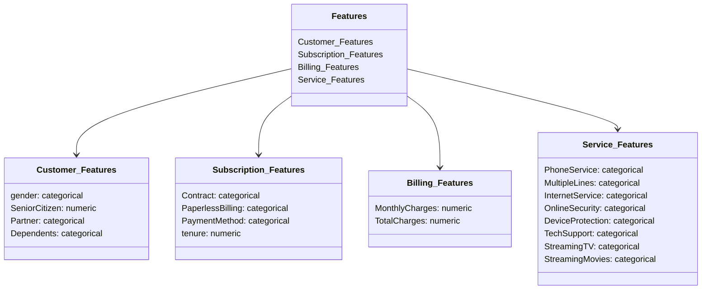

## Business Context:
The project aims to develop a machine learning system to predict customer churn in the telecommunications industry.

Customer churn is defined as when customers discontinue their business with a firm. Retaining existing customers is more cost-effective than acquiring new ones, making churn prediction a critical business metric.

Telecom companies face annual churn rates of 15-25% due to intense competition. By predicting churn, these companies can proactively focus on retaining high-risk customers, improving customer loyalty, and expanding their market position.

Reducing churn not only helps preserve the existing customer base but also lowers acquisition costs, increases profitability, and ensures long-term growth. The project aims to develop insights and actionable strategies to minimize customer attrition and enhance retention efforts.

## Key Stakeholders
**Telecom Companies**:
To improve customer retention strategies, reduce churn rates, and optimize profitability.

**Customer Retention Teams**:
For identifying high-risk customers and deploying targeted retention campaigns.

**Business Analysts**:
To analyze patterns and trends in customer behavior and churn.

**Marketing Teams**:
To tailor personalized offerings and incentives for at-risk customers.

**Data Scientists**:
To build and refine predictive churn models, enabling actionable insights.

**Executives and Decision Makers**:
To align strategic business goals with churn reduction efforts, ultimately driving customer satisfaction and revenue growth.

# Dataset Details:
> Download the dataset from Kaggle https://www.kaggle.com/code/bandiatindra/telecom-churn-prediction 

Let's visualize the data structure and features:


---
### Explanation:
1. **Customer_Features:** Contains demographic attributes like gender, SeniorCitizen status, and family-related information (Partner and Dependents).
2. **Subscription_Features:** Includes details about the customer's subscription plan (Contract, billing methods, and tenure).
3. **Billing_Features:** Focuses on financial details like monthly and total charges.
4. **Service_Features:** Describes the various services and options available to the customer.

# **Setup Instructions**

1. **Set Up a Virtual Environment**  
   ```bash
   python3 -m venv venv
   source venv/bin/activate  # For Linux/Mac
   venv\Scripts\activate     # For Windows
   ```

2. **Install Required Packages**  
   Install the dependencies specified in `requirements.txt`:
   ```bash
   pip install -r requirements.txt
   ```

3. **Install the Project**  
   Use the following command to install the project setup:
   ```bash
   make setup
   ```

## **How to Run the Project**

### **Step 1: Start MLflow Server**
Before running the training pipeline, start the MLflow server to track your experiments:
- **Option 1**: Run MLflow UI locally:
   ```bash
   mlflow ui
   ```
- **Option 2**: Host MLflow server:
   ```bash
   mlflow server --host 0.0.0.0 --port 5000
   ```

### **Step 2: Run the Training Pipeline**
Navigate to the directory containing the pipeline scripts:
```bash
cd src/pipeline
```
Run the script `training_pipeline.py`:
```bash
python training_pipeline.py
```
After the completion, use the MLflow server to view model metrics like accuracy and loss, manage training runs, and handle model versions directly in the UI.

**Pipeline Overview**:  
- **Data Ingestion:** Raw data is ingested from the `data_ingestion` directory.
- **Data Transformation:** The preprocessor transforms the data.
- **Model Training:** The model is trained and artifacts are saved in the `artifacts` folder.

The output includes:
- Train and test dataset
- A feature repository (viewable via Feast).
- Serialized preprocessor (`preprocessor.pkl`).
- Serialized model (`model.pkl`).

---

## **Feature Store Overview**
Once the training pipeline is complete, you can explore your feature store. Feast stores and serves features for the model. Use the Feast UI to explore feature statistics, schemas, and values to ensure consistency.
```bash
feast ui
```

---

## **Prediction Pipeline**

For testing the trained model, use the prediction pipeline:
1. Navigate to the example prediction script.
2. Run the script:
   ```bash
   python predict_example.py
   ```
3. Modify `predict_example.py` as needed to suit your requirements.

Upon running, the script will provide prediction results based on the model.

---

